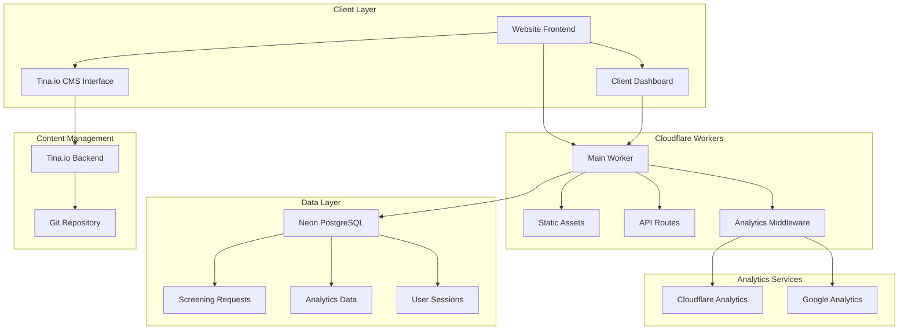

# Design Document

## Overview

This design outlines the transformation of the existing film screening website into a comprehensive client-managed solution. The architecture will integrate Tina.io for content management, deploy to Cloudflare Workers for global performance, implement dual analytics tracking, and provide a client dashboard for traffic monitoring and lead management.

The existing application is a React-based film screening website with Express.js backend, Neon PostgreSQL database, and form submission capabilities. The design preserves all existing functionality while adding new capabilities.

## Architecture

### High-Level Architecture



### Deployment Architecture

The application will be deployed as a Cloudflare Worker with the following structure:
- **Main Worker**: Handles all HTTP requests, routing, and middleware
- **Static Assets**: Served from Cloudflare's edge network
- **Database**: Neon PostgreSQL for persistent data storage
- **CMS**: Tina.io integrated with Git-based content management

## Components and Interfaces

### 1. Tina.io CMS Integration

**Purpose**: Enable client content editing without technical knowledge

**Components**:
- **TinaCMS Configuration**: Schema definitions for editable content areas
- **Content Collections**: Page content, hero sections, FAQ items, form configurations
- **Git Integration**: Automatic commits and deployments on content changes
- **Authentication**: Secure access to CMS interface

**Key Files**:
- `tina/config.ts` - TinaCMS configuration and schema definitions
- `tina/queries.ts` - GraphQL queries for content retrieval
- Content files in `content/` directory (markdown/JSON)

### 2. Cloudflare Workers Deployment

**Purpose**: Global edge deployment with high performance

**Components**:
- **Worker Entry Point**: Main request handler and router
- **Asset Serving**: Static file delivery from edge locations
- **API Middleware**: Request processing and response handling
- **Environment Configuration**: Production and development settings

**Key Modifications**:
- Adapt Express.js routes to Cloudflare Workers API
- Implement Cloudflare-compatible session management
- Configure asset bundling and deployment pipeline

### 3. Analytics Integration

**Purpose**: Comprehensive traffic tracking and conversion monitoring

**Components**:
- **Analytics Middleware**: Dual tracking implementation
- **Event Tracking**: Page views, form submissions, user interactions
- **Data Collection**: User sessions, geographic data, referral sources
- **Error Handling**: Graceful degradation if one service fails

**Implementation**:
- Cloudflare Analytics: Built-in worker analytics
- Google Analytics 4: Custom implementation with gtag
- Custom events for form submissions and conversions

### 4. Client Dashboard

**Purpose**: Traffic monitoring and lead management interface

**Components**:
- **Authentication System**: Secure login for authorized users
- **Analytics Visualization**: Charts and graphs using Recharts
- **Lead Management**: Display and manage screening requests
- **Real-time Updates**: Live data refresh capabilities

**Dashboard Sections**:
- Traffic Overview (page views, unique visitors, sessions)
- Geographic Distribution
- Referral Sources
- Conversion Funnel
- Lead Management (screening requests with contact details)
- Export Capabilities

### 5. Database Schema Extensions

**Purpose**: Support analytics data and user management

**New Tables**:
```sql
-- Analytics data storage
analytics_events (
  id SERIAL PRIMARY KEY,
  event_type VARCHAR(50),
  page_path TEXT,
  user_session VARCHAR(255),
  user_agent TEXT,
  ip_address INET,
  country VARCHAR(2),
  referrer TEXT,
  timestamp TIMESTAMP DEFAULT NOW()
);

-- Dashboard users
dashboard_users (
  id SERIAL PRIMARY KEY,
  email VARCHAR(255) UNIQUE,
  password_hash VARCHAR(255),
  role VARCHAR(50) DEFAULT 'client',
  created_at TIMESTAMP DEFAULT NOW(),
  last_login TIMESTAMP
);

-- User sessions for dashboard
user_sessions (
  id VARCHAR(255) PRIMARY KEY,
  user_id INTEGER REFERENCES dashboard_users(id),
  expires_at TIMESTAMP,
  created_at TIMESTAMP DEFAULT NOW()
);
```

## Data Models

### Content Management Models

```typescript
// Tina.io Schema Definitions
interface PageContent {
  title: string;
  hero: {
    headline: string;
    subtitle: string;
    backgroundImage: string;
    ctaText: string;
    ctaLink: string;
  };
  sections: ContentSection[];
}

interface ContentSection {
  type: 'text' | 'image' | 'video' | 'form' | 'faq';
  content: any;
  settings: {
    visible: boolean;
    order: number;
  };
}
```

### Analytics Models

```typescript
interface AnalyticsEvent {
  id: number;
  eventType: 'page_view' | 'form_submission' | 'video_play' | 'download';
  pagePath: string;
  userSession: string;
  userAgent: string;
  ipAddress: string;
  country: string;
  referrer: string;
  timestamp: Date;
}

interface DashboardMetrics {
  pageViews: number;
  uniqueVisitors: number;
  sessions: number;
  conversionRate: number;
  topPages: PageMetric[];
  geographicData: CountryMetric[];
  referralSources: ReferralMetric[];
}
```

### Lead Management Models

```typescript
// Extending existing ScreeningRequest
interface EnhancedScreeningRequest extends ScreeningRequest {
  source: string; // referral source
  userAgent: string;
  ipAddress: string;
  sessionId: string;
  conversionPath: string[]; // pages visited before conversion
}
```

## Error Handling

### CMS Error Handling
- **Content Loading Failures**: Fallback to cached content or default values
- **Git Integration Issues**: Queue changes for retry, notify administrators
- **Authentication Failures**: Clear error messages, secure fallback behavior

### Analytics Error Handling
- **Service Unavailability**: Continue with available service, log failures
- **Data Collection Failures**: Implement retry logic with exponential backoff
- **Privacy Compliance**: Respect user preferences and GDPR requirements

### Dashboard Error Handling
- **Authentication Errors**: Secure session management, clear error messages
- **Data Visualization Failures**: Graceful degradation, alternative data views
- **Database Connection Issues**: Connection pooling, retry mechanisms

### Deployment Error Handling
- **Worker Deployment Failures**: Rollback mechanisms, health checks
- **Asset Serving Issues**: CDN fallbacks, error monitoring
- **Database Migration Errors**: Transaction rollbacks, data integrity checks

## Testing Strategy

### Unit Testing
- **Component Testing**: React components with Jest and React Testing Library
- **API Testing**: Worker functions and database operations
- **CMS Integration**: Content loading and schema validation
- **Analytics Functions**: Event tracking and data collection

### Integration Testing
- **End-to-End Workflows**: Complete user journeys from content editing to analytics
- **Database Integration**: Data persistence and retrieval across all components
- **Third-party Services**: Tina.io, Cloudflare Analytics, Google Analytics integration
- **Authentication Flows**: Login, session management, and authorization

### Performance Testing
- **Worker Performance**: Response times and resource usage
- **Database Queries**: Query optimization and connection pooling
- **Asset Loading**: Static file delivery and caching effectiveness
- **Analytics Impact**: Minimal performance overhead from tracking

### Security Testing
- **Authentication Security**: Password hashing, session management, CSRF protection
- **Data Privacy**: PII handling, analytics data anonymization
- **Input Validation**: Form submissions, CMS content, API parameters
- **Access Control**: Role-based permissions, unauthorized access prevention

### Deployment Testing
- **Staging Environment**: Full feature testing before production deployment
- **Rollback Procedures**: Quick reversion capabilities for failed deployments
- **Health Monitoring**: Automated checks for service availability and performance
- **Data Migration**: Safe database schema updates and data preservation